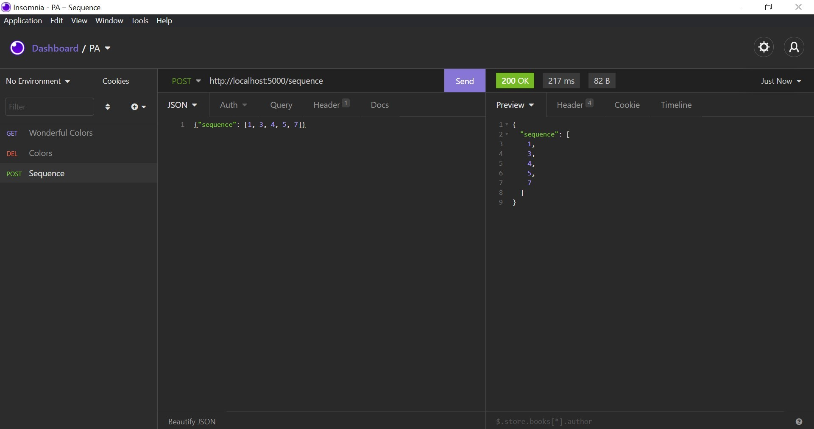

# Wonderful Coloring

**Número da Lista**: 20 
**Conteúdo da Disciplina**: Greed 

## Alunos

| Matrícula  | Aluno                           |
| ---------- | ------------------------------- |
| 18/0054848 | Rhuan Carlos Pereira de Queiroz |
| 18/0028308 | Thiago Guilherme Muniz Ferreira |

## Sobre

É uma API (Application Programming Interface) baseada na questão [Wonderful Coloring](https://codeforces.com/problemset/problem/1551/B2) do Codeforces. A ideia da API é ser utilizada junto com um banco de dados volátil, no caso o Redis, para armazenar as sequências e as cores. Ao fazer uma requisição **GET**, a API retorna uma sequência de cores, que é uma solução possível para o problema.

## Screenshots

## Instalação

**Linguagem**: Python

**Framework**: Flask

Docker e Docker-Compose

### Build dos containers

`docker-compose build`

### Execução dos serviços

`docker-compose up`

## Uso

Para usar a API, provavelmente você precisará de um aplicativo que seja capaz de consumir a API. Exemplo: Postman, Insomnia, etc.

Os endpoints disponíveis são:

    - POST /sequence
    - DELETE /sequence
    - POST /colors
    - DELETE /colors
    - GET /wonderful-colors

Os padrões de requisição obedecem aos screenshots acima.

## Outros

Se você não tiver Docker, lamentamos, terá que instalar os pacotes:

`pip3 install -r requirements.txt`

E precisará também instalar o Redis:

- [Redis](https://redis.io/download)

Execute a API com o seguinte comando:

`python3 app.py` ou `flask run`
